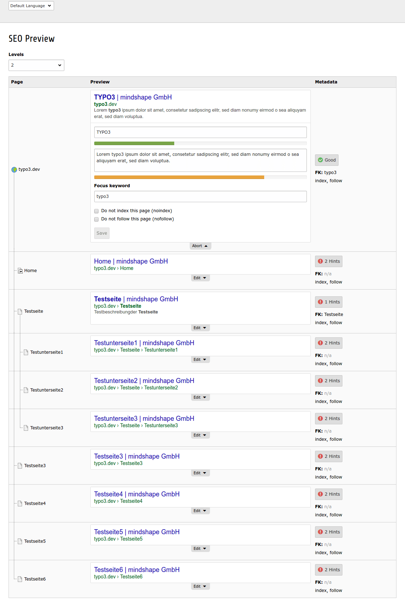
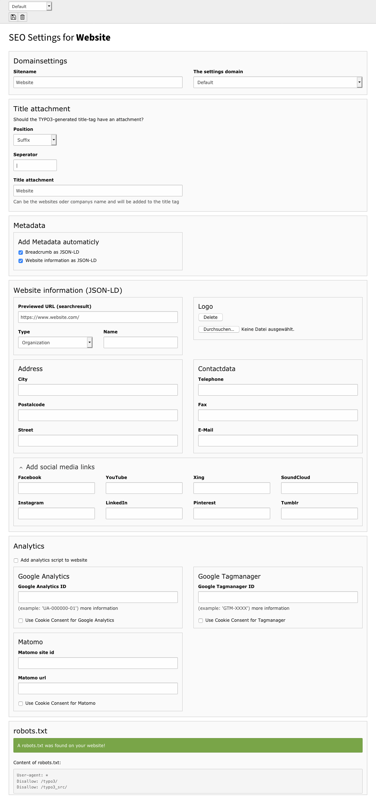
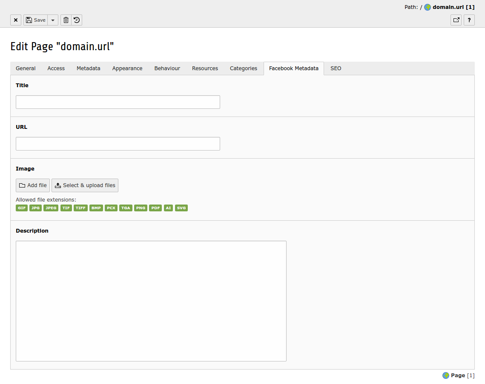
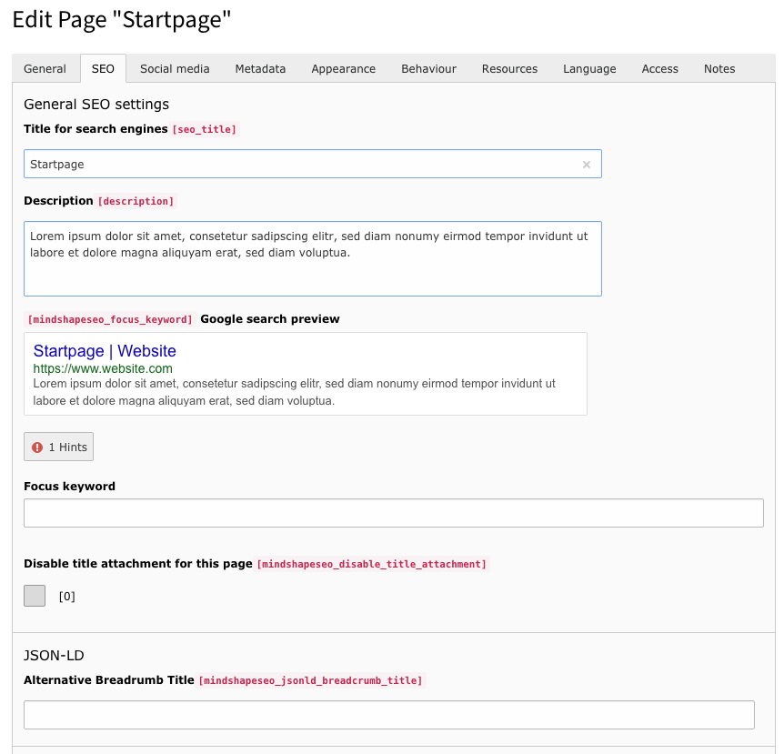

.. ==================================================
.. FOR YOUR INFORMATION
.. --------------------------------------------------
.. -*- coding: utf-8 -*- with BOM.

.. include:: ../Includes.txt

Introduction
============

What does it do?
----------------

This extension gives you all necessary functions to setup
your websites SEO to the best.

Advantage of mindshape_seo
--------------------------

+ SEO configurations for each domain

+ New fields for pages

+ Sitemap.xml generator (incl. sub sitemap option on each page)

+ Google SERP preview for pages

+ Facebook Metadata

+ Metadata validation

Screenshots
-----------

    The preview module offers an overview of alle subpages, with google preview SEO check and inline editing

    The settings module lets you configure your global SEO settings for each domain

    The page module has been extendet with additional fields to add facebook meta tags

    The page module has been extendet with additional fields and functions to optimize a single page for search engines
